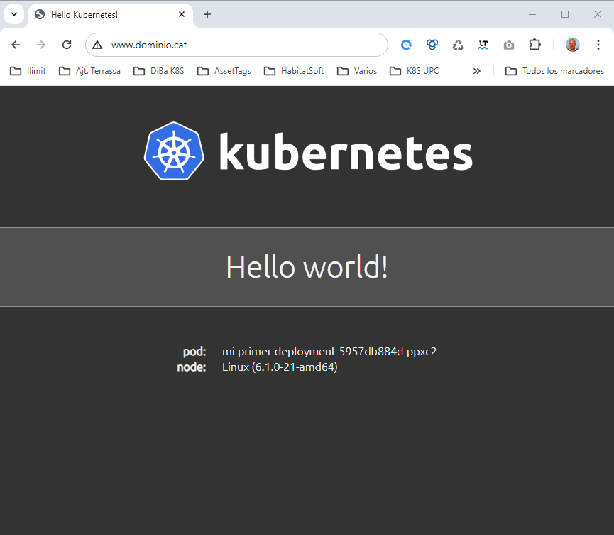
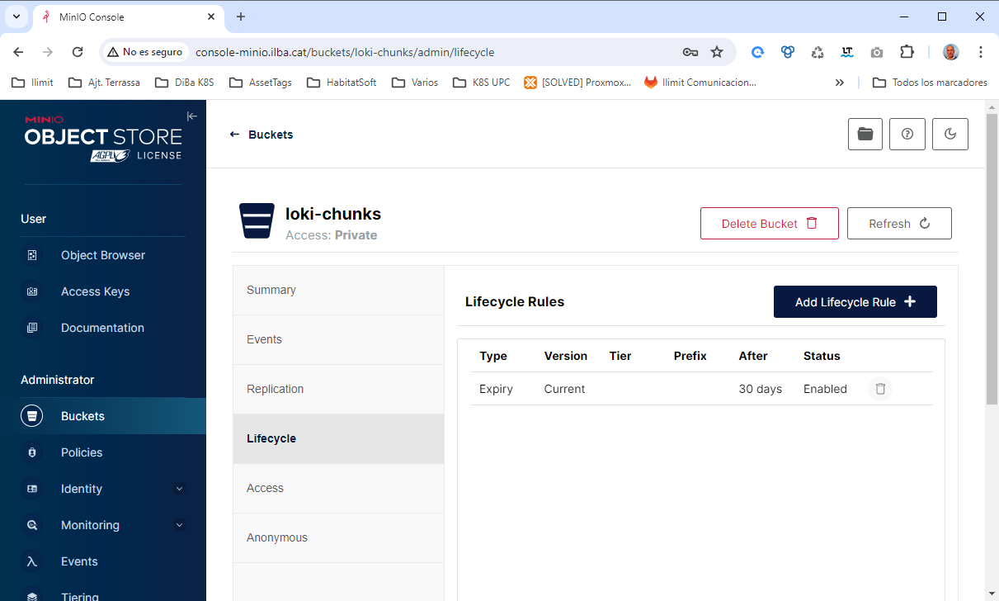
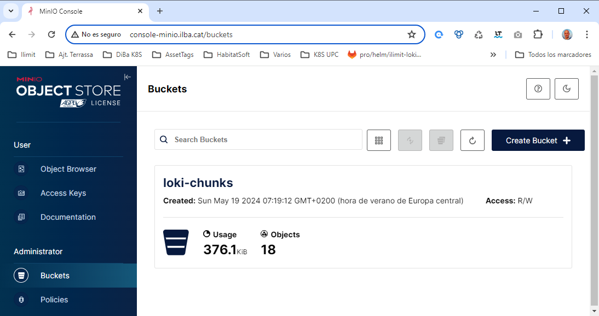
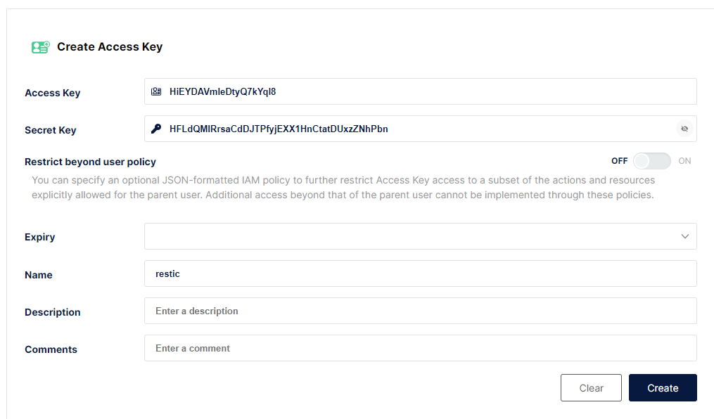
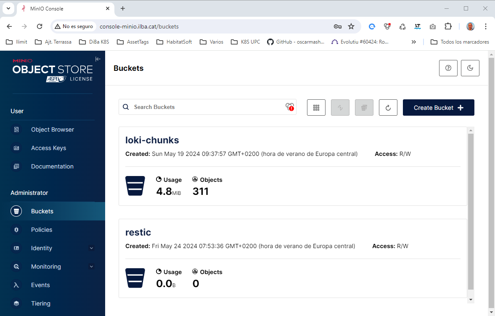
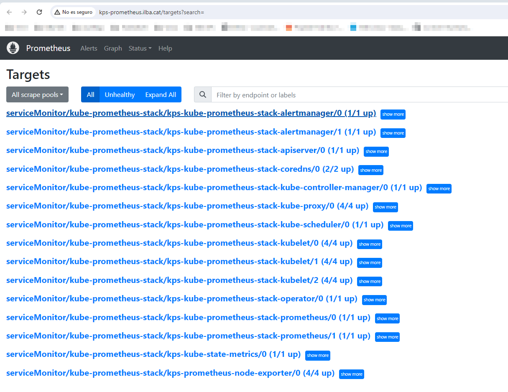
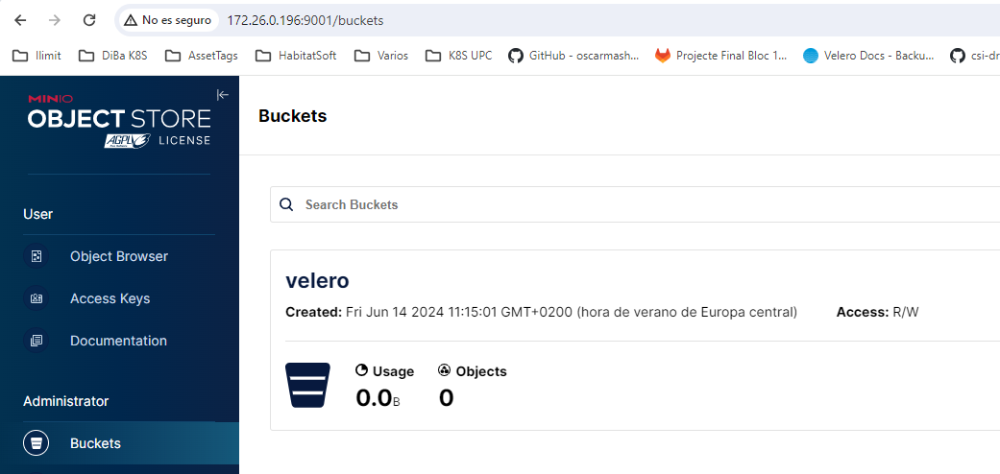
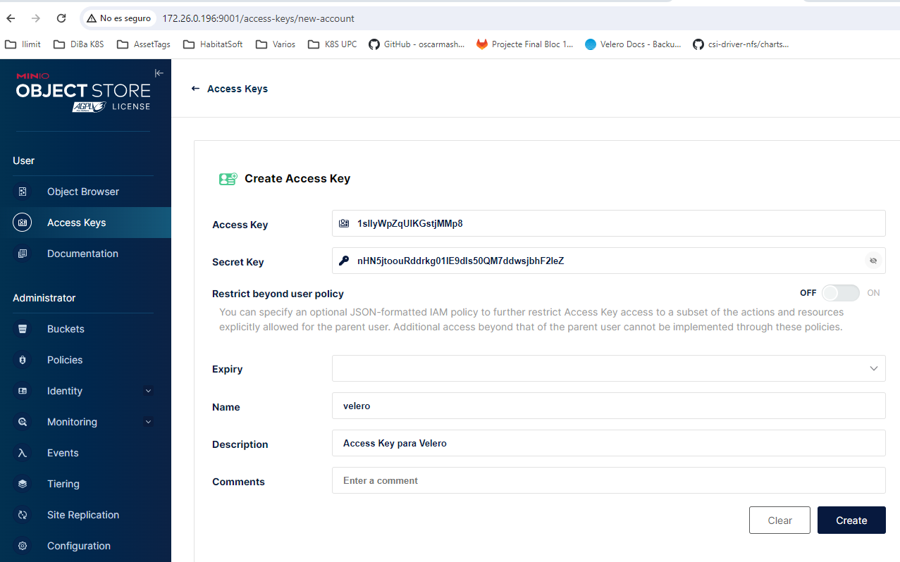

# **Tacle of Contents**
* [Cosas personales](#id1)
* [Instalación de K8S](#id2)
* [Instalación de HELMS - Bootstrap](#id3)
* [Instalación de HELMS - Stack Loki](#id4)
* [Logs customs](#id5)
* [Backups con Restic y MinIO](#id6)
* [Instalación de HELMS - NFS + KPS](#id7)
* [Instalación de Velero](#id8)

# Start / Stop VM <div id='id1' />

```
$ cd ilba/kubespray-diba
```

## Arrancar equipos

```
ssh root@172.26.0.71 -C "qm start 9191 && qm start 9192" && ssh root@172.26.0.72 -C "qm start 9193 && qm start 9194" && ssh root@172.26.0.72 -C "qm start 144"
```

## Para equipos

```
LO HACES A MANO
```

## Acceso

```
ssh 172.26.0.191
```

# Kubernetes <div id='id2' />

## Instalación

```
$ make install
```

```
root@diba-master:~# kubectl get nodes -o wide
NAME            STATUS   ROLES           AGE     VERSION   INTERNAL-IP    EXTERNAL-IP   OS-IMAGE                         KERNEL-VERSION   CONTAINER-RUNTIME
diba-master     Ready    control-plane   3m48s   v1.28.6   172.26.0.191   <none>        Debian GNU/Linux 12 (bookworm)   6.1.0-21-amd64   containerd://1.7.11
diba-master-1   Ready    <none>          3m2s    v1.28.6   172.26.0.192   <none>        Debian GNU/Linux 12 (bookworm)   6.1.0-21-amd64   containerd://1.7.11
diba-master-2   Ready    <none>          3m3s    v1.28.6   172.26.0.193   <none>        Debian GNU/Linux 12 (bookworm)   6.1.0-21-amd64   containerd://1.7.11
diba-master-3   Ready    <none>          3m1s    v1.28.6   172.26.0.194   <none>        Debian GNU/Linux 12 (bookworm)   6.1.0-21-amd64   containerd://1.7.1
```

# Instalación de HELMS <div id='id3' />

## Instalar Helm

```
curl https://baltocdn.com/helm/signing.asc | gpg --dearmor | tee /usr/share/keyrings/helm.gpg > /dev/null
apt-get update && apt-get install apt-transport-https --yes
echo "deb [arch=$(dpkg --print-architecture) signed-by=/usr/share/keyrings/helm.gpg] https://baltocdn.com/helm/stable/debian/ all main" | tee /etc/apt/sources.list.d/helm-stable-debian.list
apt-get update && apt-get install helm
```

## metallb

```
helm repo add metallb https://metallb.github.io/metallb && helm repo update
```

```
$ helm upgrade --install \
metallb metallb/metallb \
--create-namespace \
--namespace metallb-system \
--version=0.13.11
```

```
cat <<EOF >> crd-ip.yaml
# This was autogenerated by MetalLB's custom resource generator.
apiVersion: metallb.io/v1beta1
kind: IPAddressPool
metadata:
  creationTimestamp: null
  name: default
  namespace: metallb-system
spec:
  addresses:
  - 172.26.0.101-172.26.0.105
status: {}
---
apiVersion: metallb.io/v1beta1
kind: L2Advertisement
metadata:
  creationTimestamp: null
  name: l2advertisement1
  namespace: metallb-system
spec:
  ipAddressPools:
  - default
status: {}
---
EOF
```

```
root@diba-master:~# kubectl apply -f crd-ip.yaml
```

## nginx

```
helm repo add ingress-nginx https://kubernetes.github.io/ingress-nginx && helm repo update
```

```
cat <<EOF >> values-nginx.yaml
controller:
  service:
    type: LoadBalancer
    externalTrafficPolicy: "Local"
  publishService:
    enabled: true
  kind: DaemonSet
EOF
```

```
helm upgrade --install \
ingress-nginx ingress-nginx/ingress-nginx \
--create-namespace \
--namespace ingress-nginx \
--version=4.7.1 \
-f values-nginx.yaml
```

## testing

```
root@diba-master:~# cat testing.yaml
apiVersion: v1
kind: Namespace
metadata:
  name: test-metallb
---
apiVersion: apps/v1
kind: Deployment
metadata:
  name: mi-primer-deployment
  namespace: test-metallb
spec:
  selector:
    matchLabels:
      app: mi-primer-deployment
  replicas: 2
  template:
    metadata:
       labels:
          app: mi-primer-deployment
    spec:
      containers:
      - name: mi-primer-deployment
        image: paulbouwer/hello-kubernetes:1.9
        ports:
        - containerPort: 8080
---
apiVersion: v1
kind: Service
metadata:
  name: mi-primer-service
  namespace: test-metallb
  labels:
     app: mi-primer-service
spec:
  type: ClusterIP
  selector:
    app: mi-primer-deployment
  ports:
    - port: 80
      targetPort: 8080
---
apiVersion: networking.k8s.io/v1
kind: Ingress
metadata:
  name: mi-primer-ingress
  namespace: test-metallb
  annotations:
    kubernetes.io/ingress.class: "nginx"
spec:
  rules:
    - host: www.dominio.cat
      http:
        paths:
          - path: /
            pathType: Prefix
            backend:
               service:
                  name: mi-primer-service
                  port:
                     number: 80
```

```
root@diba-master:~# kubectl apply -f testing.yaml
```

Verificamos que funcione [la web de testing](http://www.dominio.cat):



# Instalación del stack de Loki <div id='id4' />

## MinIO

### Errores minio

Para desplegar minio, el equipo ha de tener la siguiente flag:

```
root@diba-master:~# kubectl -n minio logs -f minio-post-job-bsl9n minio-make-policy
Fatal glibc error: CPU does not support x86-64-v2
```

**SOLVED** switched to [x86-64-v2-AES CPU type](https://github.com/makeplane/plane/issues/3527#issuecomment-1925070815)


### Instalación minio

Crear el directorio en los workers, ya que en este caso no usaremos un storage compartido, se usará el storage local de cada worker de K8S:

```
mkdir /disk-local-minio-data
```

```
$ cat values-minio.yaml

mode: distributed

persistence:
  enabled: false

extraVolumes:
  - name: minio-data
    hostPath:
      path: /disk-local-minio-data
      type: Directory
extraVolumeMounts:
  - name: minio-data
    mountPath: /export

drivesPerNode: 1
replicas: 3
pools: 1

ingress:
  enabled: true
  ingressClassName: "nginx"
  labels: {}
  annotations: {}
  path: /
  hosts:
    - api-minio.ilba.cat
  tls: []

consoleIngress:
  enabled: true
  ingressClassName: "nginx"
  labels: {}
  annotations: {}
  path: /
  hosts:
    - console-minio.ilba.cat
  tls: []

resources:
  requests:
    memory: 1Gi

users:
  - accessKey: admin
    secretKey: admin-password
    policy: consoleAdmin
  - accessKey: loki
    secretKey: loki-password
    policy: loki-policy

policies:
- name: loki-policy
  statements:
    - resources:
        - 'arn:aws:s3:::loki-*/*'
      actions:
        - "s3:AbortMultipartUpload"
        - "s3:GetObject"
        - "s3:DeleteObject"
        - "s3:PutObject"
        - "s3:ListMultipartUploadParts"
    - resources:
        - 'arn:aws:s3:::loki-*'
      actions:
        - "s3:CreateBucket"
        - "s3:DeleteBucket"
        - "s3:GetBucketLocation"
        - "s3:ListBucket"
        - "s3:ListBucketMultipartUploads"

buckets:
  - name: loki-chunks
    policy: none
    purge: false

nodeAffinity:
  required:
    nodeSelectorTerms:
    - matchExpressions:
      - key: kubernetes.io/hostname
        operator: In
        values:
        - diba-master-1
        - diba-master-2
        - diba-master-3
```


```
helm repo add minio https://charts.min.io/ && helm repo update
```

```
helm upgrade --install \
minio minio/minio \
--create-namespace \
--namespace minio \
--version=5.0.15 \
-f values-minio.yaml
```

### Verificaciones de MinIO

```
root@diba-master:~# helm ls -n minio
NAME    NAMESPACE       REVISION        UPDATED                                         STATUS          CHART           APP VERSION
minio   minio           1               2024-05-17 10:31:58.495053209 +0200 CEST        deployed        minio-5.0.15    RELEASE.2024-01-11T07-46-16Z
```

```
root@diba-master:~# kubectl -n minio get pods -o wide
NAME      READY   STATUS    RESTARTS   AGE     IP            NODE            NOMINATED NODE   READINESS GATES
minio-0   1/1     Running   0          2m54s   10.38.28.19   diba-master-2   <none>           <none>
minio-1   1/1     Running   0          2m54s   10.38.25.14   diba-master-1   <none>           <none>
minio-2   1/1     Running   0          2m54s   10.38.26.12   diba-master-3   <none>           <none>
```

```
root@diba-master:~# kubectl get ingress -A
NAMESPACE      NAME                CLASS    HOSTS                    ADDRESS        PORTS   AGE
minio          minio               nginx    api-minio.ilba.cat       172.26.0.101   80      68s
minio          minio-console       nginx    console-minio.ilba.cat   172.26.0.101   80      68s
```

Verificar que en los workes se ha creado la estructura de directorios

```
$ ls -la /disk-local-minio-data/
total 16
drwxr-xr-x  4 root root 4096 May 17 10:32 .
drwxr-xr-x 19 root root 4096 May 17 10:13 ..
drwxr-xr-x  2 root root 4096 May 17 10:32 loki-chunks
drwxr-xr-x  6 root root 4096 May 17 10:32 .minio.sys
```

Verificamos que se pueda acceder via web:
* URL: [console-minio.ilba.cat](http://console-minio.ilba.cat)
* Username: admin
* Password: admin-password

### Cosas a hacer en MinIO

Hay que crear a mano el "Lifecycle Rules":



## Loki

### Instalación de Loki

```
helm repo add grafana https://grafana.github.io/helm-charts && helm repo update
```

**NOTA:** No modificar las replicas del fichero _values-loki.yaml_, ya que son las mínimas que para que pueda funcionar.  
Por ejemplo: si bajamos las réplicas del _backend_ a 1, después cuando configuremos Grafana, no funcionará y saldrá el siguiente error: 
[Status: 500. Message: index gateway get ring: too many unhealthy instances in the ring](https://github.com/grafana/loki/issues/10537#issuecomment-1717322802)


```
$ cat values-loki.yaml
global:
  dnsService: "coredns"

loki:
  auth_enabled: false
  compactor:
    retention_enabled: true
  storage:
    bucketNames:
      chunks: loki-chunks
      ruler: loki-chunks
      admin: loki-chunks
    type: s3
    s3:
      endpoint: http://minio.minio.svc.cluster.local:9000
      accessKeyId: loki
      secretAccessKey: loki-password
      s3ForcePathStyle: true
      insecure: false
      http_config:
        insecure_skip_verify: true

write:
  replicas: 2
  persistence:
    volumeClaimsEnabled: false

read:
  replicas: 2
  persistence:
    volumeClaimsEnabled: false

gateway:
  replicas: 2
  ingress:
    enabled: true
    ingressClassName: nginx
    hosts:
      - host: gateway-loki.ilba.cat
        paths:
          - path: /
            pathType: Prefix
    tls: []

  basicAuth:
    enabled: true
    username: loki-gateway
    password: loki-gateway-password

backend:
  replicas: 3
  persistence:
    volumeClaimsEnabled: false
```

```
helm upgrade --install \
loki grafana/loki \
--create-namespace \
--namespace loki \
--version=5.47.2 \
-f values-loki.yaml
```

### Verificaciones de Loki

```
root@diba-master:~# helm ls -n loki
NAME    NAMESPACE       REVISION        UPDATED                                         STATUS          CHART           APP VERSION
loki    loki            1               2024-05-17 13:15:47.659556826 +0200 CEST        deployed        loki-5.47.2     2.9.6
```

```
root@diba-master:~# kubectl -n loki get pods
NAME                                           READY   STATUS    RESTARTS   AGE
loki-backend-0                                 1/2     Running   0          3m57s
loki-canary-cmn7p                              1/1     Running   0          3m58s
loki-canary-krngx                              1/1     Running   0          3m58s
loki-canary-zmztt                              1/1     Running   0          3m58s
loki-gateway-5ccdb57c44-spmhl                  1/1     Running   0          38s
loki-grafana-agent-operator-59556555b8-hrlh9   1/1     Running   0          3m58s
loki-logs-62ltq                                2/2     Running   0          3m35s
loki-logs-l79sd                                2/2     Running   0          3m35s
loki-logs-wkszz                                2/2     Running   0          3m35s
loki-read-6d9b895c4-v6bf6                      1/1     Running   0          3m58s
loki-write-0                                   1/1     Running   0          3m57s
```

```
root@diba-master:~# kubectl get ingress -A
NAMESPACE      NAME                CLASS    HOSTS                    ADDRESS        PORTS   AGE
loki           loki-gateway        nginx    gateway-loki.ilba.cat    172.26.0.101   80      7m4s
```

## Promtail

### Instalación de Promtail

```
$ cat values-promtail.yaml
config:
   clients:
    - url: http://loki-gateway.loki.svc.cluster.local/loki/api/v1/push
      basic_auth:
         username: loki-gateway
         password: loki-gateway-password
```

```
helm upgrade --install \
promtail grafana/promtail \
--create-namespace \
--namespace promtail \
--version=6.15.5 \
-f values-promtail.yaml
```

### Verificaciones de Promtail

```
root@diba-master:~# helm -n promtail ls
NAME            NAMESPACE       REVISION        UPDATED                                         STATUS          CHART           APP VERSION
promtail        promtail        1               2024-05-17 19:16:05.444210472 +0200 CEST        deployed        promtail-6.15.5 2.9.3
```

Verificamos que estén todos los pods.  
Ha de haber tantos pods como "control plane" + "workers" hayan.  
En este ejemplo hay 1 "control plane" + 3 "workers", en total 4 pods

```
root@diba-master:~# kubectl -n promtail get pods
NAME             READY   STATUS    RESTARTS   AGE
promtail-9bs8m   1/1     Running   0          4m55s
promtail-gr8kf   1/1     Running   0          4m55s
promtail-mftxx   1/1     Running   0          4m55s
promtail-pczlh   1/1     Running   0          4m55s
```

Verificamos los logs de algún contenedor de promtail, para que no salga ningún error:

```
root@diba-master:~# kubectl -n promtail logs -f promtail-gr8kf
```

## Send logs to Loki

```
root@diba-master:~# kubectl get ingress -A
NAMESPACE      NAME                CLASS    HOSTS                    ADDRESS        PORTS   AGE
test-metallb   mi-primer-ingress   <none>   www.dominio.cat          172.26.0.101   80      3d
```

### Accediendo por Consola

```
$ while curl -sI -o /dev/null -w "%{http_code}\n" -H "Host: www.dominio.cat" "http://172.26.0.101/"; do sleep 1; done;
```

### Accediendo por URL

Acceso a la [web de testing](http://www.dominio.cat/)


## Config Grafana con Loki

Verificamos que en el MinIO se haya guardado algo de datos:

* URL: [console-minio.ilba.cat](http://console-minio.ilba.cat)
* Username: admin
* Password: admin-password



Accedemos a [Grafana](http://172.26.0.32:3000) (está ubicado fuera del cluster de K8S)

Configuramos el Data Source:

* Name: Loki-K8S
* URL: http://gateway-loki.ilba.cat
* User: loki-gateway
* Password: loki-gateway-password

Importar Dashboard: [15141](https://grafana.com/grafana/dashboards/15141-kubernetes-service-logs/)

# Logs customs <div id='id5' />

**A partir de aquí todo son pruebas**


En cada "worker" + "control plane" crearemos los directorios:

```
$ mkdir -p /var/log/kubernetes/sites_logs && mkdir /var/log/messages
```

## Opción 1

_La idea sería que el porpio HELM de promtail cogiera los logs y los guardase_

```
$ vim values-promtail.yaml
config:
  clients:
   - url: http://loki-gateway.loki.svc.cluster.local/loki/api/v1/push
     basic_auth:
        username: loki-gateway
        password: loki-gateway-password

  snippets:
    extraScrapeConfigs: |
      - job_name: sites-logs
        static_configs:
          - targets:
              - localhost
            labels:
              job: <server>_varlogs
              __path__: /sites_log/*.log

extraVolumes:
  - name: sites-logs
    hostPath:
      path: /var/log/kubernetes/sites_logs
      type: Directory
extraVolumeMounts:
  - name: sites-logs
    mountPath: /sites_logs
```

```
helm upgrade --install \
promtail grafana/promtail \
--create-namespace \
--namespace promtail \
--version=6.15.5 \
-f values-promtail.yaml
```

```
root@diba-master:~# kubectl -n promtail delete pods --all
```

```
root@diba-master:~# kubectl -n promtail get pods -o wide | grep master
promtail-nt5bc   1/1     Running   0          2m20s   10.38.31.16   diba-master     <none>           <none>

root@diba-master:~# echo "hoooola" > /var/log/kubernetes/sites_logs/test.log

root@diba-master:~# kubectl -n promtail exec -it promtail-nt5bc -- cat /sites_logs/test.log
hoooola
```

Accedemos a [Grafana](http://172.26.0.32:3000) (está ubicado fuera del cluster de K8S)

Continuarà.........................

## Opción v2

_La idea sería instalar el promtail via ansible, crear otro loki para esta necesidad y ponerlo en otro bucket del Minio (no es neceasrio desplegar otro minio)_


Descarga de  [promtail](https://github.com/grafana/loki/releases/)

```
wget https://github.com/grafana/loki/releases/download/v2.9.8/promtail-linux-amd64.zip
```

El montaje sería tipo [este](https://psujit775.medium.com/how-to-setup-promtail-in-ubuntu-20-04-ed652b7c47c3), pero via Ansible

Continuarà.........................

# Backups con Restic y MinIO <div id='id6' />

**Esto no es para hacer backups de MinIO, es para hacer backups de tus ficheros y subirlos a MinIO**

Información sacada de: https://blog.min.io/back-up-restic-minio/

```
root@diba-master:~# apt update && apt install restic
root@diba-master:~# restic self-update
```

Creamos las Keys desde la consola GUI de MinIO:
* URL: [console-minio.ilba.cat](http://console-minio.ilba.cat)
* Username: admin
* Password: admin-password



```
ACCESS KEY: HiEYDAVmIeDtyQ7kYql8
SECRET KEY: HFLdQMIRrsaCdDJTPfyjEXX1HnCtatDUxzZNhPbn
```

```
root@diba-master:~# vim ~/.restic-env
export AWS_ACCESS_KEY_ID=HiEYDAVmIeDtyQ7kYql8
export AWS_SECRET_ACCESS_KEY=HFLdQMIRrsaCdDJTPfyjEXX1HnCtatDUxzZNhPbn
export RESTIC_REPOSITORY="s3:http://api-minio.ilba.cat/restic"
export RESTIC_PASSWORD="restic-password"

root@diba-master:~# source ~/.restic-env

root@diba-master:~# curl https://dl.min.io/client/mc/release/linux-amd64/mc -o /usr/local/bin/mc
root@diba-master:~# chmod 755 /usr/local/bin/mc

root@diba-master:~# mc alias set myminio http://api-minio.ilba.cat $AWS_ACCESS_KEY_ID $AWS_SECRET_ACCESS_KEY
root@diba-master:~# mc admin info myminio
```
> **Note** El siguiente comando tarda muchísimo

```
root@diba-master:~# restic init
```

Verificaremos que nos ha creado el nuevo bucket llamado *restic*:



etc....


# Instalación de HELMS - NFS + KPS <div id='id7' />


## Instalción de NFS

```
root@diba-master:~# helm repo add csi-driver-nfs https://raw.githubusercontent.com/kubernetes-csi/csi-driver-nfs/master/charts
root@diba-master:~# helm repo update
```

```
root@diba-master:~# cat values-csi-driver-nfs.yaml
externalSnapshotter:
  enabled: true
storageClass:
  create: true
  name: nfs-csi
  parameters:
    server: 172.26.0.195
    share: /nfsshare/diba
```

```
helm upgrade --install \
csi-driver-nfs csi-driver-nfs/csi-driver-nfs \
--create-namespace \
--namespace csi-driver-nfs \
--version=v4.7.0 \
-f values-csi-driver-nfs.yaml
```

```
root@diba-master:~# helm -n csi-driver-nfs ls
NAME            NAMESPACE       REVISION        UPDATED                                 STATUS          CHART                   APP VERSION
csi-driver-nfs  csi-driver-nfs  1               2024-06-14 07:41:37.30507464 +0200 CEST deployed        csi-driver-nfs-v4.7.0   v4.7.0

root@diba-master:~# kubectl -n csi-driver-nfs get pods
NAME                                   READY   STATUS    RESTARTS      AGE
csi-nfs-controller-65b76f5875-vjr4t    4/4     Running   0             89s
csi-nfs-node-2b5qm                     3/3     Running   0             89s
csi-nfs-node-4v9zn                     3/3     Running   0             89s
csi-nfs-node-xqgjf                     3/3     Running   0             89s
csi-nfs-node-z5bl6                     3/3     Running   0             89s
snapshot-controller-75f486ff8c-7725x   1/1     Running   0             89s

root@diba-master:~# kubectl get sc
NAME      PROVISIONER      RECLAIMPOLICY   VOLUMEBINDINGMODE   ALLOWVOLUMEEXPANSION   AGE
nfs-csi   nfs.csi.k8s.io   Delete          Immediate           false                  10m
```

## Testing de NFS

Esto no funciona, porque el contenedor no esta en modo "privileged"

```
root@diba-master:~# kubectl run test-nfs -it --image debian:12 -- bash
root@test-nfs:/# apt update && apt install -y nfs-common

root@test-nfs:/# showmount -e 172.26.0.195
clnt_create: RPC: Unknown host

root@test-nfs:/# mount -t nfs 172.26.0.195:/nfsshare/diba /mnt/
mount.nfs: rpc.statd is not running but is required for remote locking.
mount.nfs: Either use '-o nolock' to keep locks local, or start statd.
mount.nfs: access denied by server while mounting 172.26.0.195:/nfsshare/diba

root@test-nfs:/# mount.nfs4 172.26.0.195:/nfsshare /mnt/
mount.nfs4: access denied by server while mounting 172.26.0.195:/nfsshare

root@test-nfs:/# exit
root@diba-master:~# kubectl delete pod test-nfs
```


```
root@diba-nfs:~# mkdir /nfsshare/diba

root@diba-master:~# cat test-nfs.yaml
kind: PersistentVolumeClaim
apiVersion: v1
metadata:
  name: test-dynamic-volume-claim
  namespace: default
spec:
  storageClassName: nfs-csi
  accessModes:
    - ReadWriteOnce
  resources:
    requests:
      storage: 666Mi
---
apiVersion: v1
kind: Pod
metadata:
  name: nginx
  namespace: default
spec:
  containers:
  - name: nginx
    image: nginx
    volumeMounts:
    - name: nfs-server
      mountPath: /usr/share/nginx/html
  volumes:
  - name: nfs-server
    persistentVolumeClaim:
      claimName: test-dynamic-volume-claim

root@diba-master:~# kubectl apply -f test-nfs.yaml

root@diba-master:~# kubectl exec -it nginx -- df -h | grep diba
172.26.0.195:/nfsshare/diba/pvc-0521856c-a782-4b9a-ab38-ab3063c96780   62G  2.1G   57G   4% /usr/share/nginx/html

root@diba-master:~# kubectl delete -f test-nfs.yaml
```

## Instalación de KPS

El fichero: values-kube-prometheus-stack.yaml, lo podemos encontrar en este repo

```
root@diba-master:~# vim values-kube-prometheus-stack.yaml
```

```
root@diba-master:~# helm repo add prometheus-community https://prometheus-community.github.io/helm-charts
root@diba-master:~# helm repo update

```

```
helm upgrade --install \
kps prometheus-community/kube-prometheus-stack \
--create-namespace \
--namespace kube-prometheus-stack \
--version=58.2.1 \
-f values-kube-prometheus-stack.yaml
```

```
root@diba-master:~# helm -n kube-prometheus-stack ls
NAME    NAMESPACE               REVISION        UPDATED                                         STATUS          CHART                           APP VERSION
kps     kube-prometheus-stack   1               2024-06-14 08:03:48.316799812 +0200 CEST        deployed        kube-prometheus-stack-58.2.1    v0.73.2
```

```
root@diba-master:~# kubectl -n kube-prometheus-stack get pods
NAME                                                    READY   STATUS    RESTARTS   AGE
alertmanager-kps-kube-prometheus-stack-alertmanager-0   2/2     Running   0          28s
kps-grafana-74465c48b-sbnt4                             3/3     Running   0          36s
kps-kube-prometheus-stack-operator-86b5d5bdfd-69h7n     1/1     Running   0          36s
kps-kube-state-metrics-66bf58f948-45q7p                 1/1     Running   0          36s
kps-prometheus-node-exporter-5wbj6                      1/1     Running   0          36s
kps-prometheus-node-exporter-g6xxm                      1/1     Running   0          36s
kps-prometheus-node-exporter-jqs4t                      1/1     Running   0          36s
kps-prometheus-node-exporter-t6j72                      1/1     Running   0          36s
prometheus-kps-kube-prometheus-stack-prometheus-0       1/2     Running   0          27s

root@diba-master:~# kubectl -n kube-prometheus-stack get pv
root@diba-master:~# kubectl -n kube-prometheus-stack get pvc
```

```
root@diba-master:~# kubectl get ingress -A
```

```
root@diba-master:~# kubectl edit cm/kube-proxy -n kube-system
    metricsBindAddress: 0.0.0.0:10249
root@diba-master:~# kubectl -n kube-system get pods | grep kube-proxy
```

Verificamos que no haya ningún error:  [http://kps-prometheus.ilba.cat/targets?search=](http://kps-prometheus.ilba.cat/targets?search=)



# Instalación de Velero <div id='id7' />

## Montaje de MinIO (por si no lo tenemos)

Recordemos que en Proxmox, la CPU ha de ser: "x86-64-v2-AES"

```
root@diba-minio:~# cat /etc/docker-compose/docker-compose.yaml
version: '3'

services:
  minio:
    container_name: minio
    hostname: minio
    image: minio/minio:RELEASE.2024-06-11T03-13-30Z
    command: server /data --console-address ":9001"
    ports:
      - 9000:9000
      - 9001:9001
    volumes:
      - minio_data:/data
      - /etc/localtime:/etc/localtime:ro
    environment:
      - MINIO_ROOT_USER=admin
      - MINIO_ROOT_PASSWORD=superpassword

volumes:
  minio_data:
    driver: local
```

Accedemos a la consola
* URL: [http://172.26.0.196:9001/](http://172.26.0.196:9001)
* Username: admin
* Password: superpassword

Crearemos el bucket:




## Instalación de Velero

Descargamos el binario de velero:

```
root@diba-master:~# wget https://github.com/vmware-tanzu/velero/releases/download/v1.13.2/velero-v1.13.2-linux-amd64.tar.gz
root@diba-master:~# tar xzvf velero-v1.13.2-linux-amd64.tar.gz
root@diba-master:~# mv velero-v1.13.2-linux-amd64/velero /usr/local/sbin/velero-v1.13.2-linux-amd64
root@diba-master:~# ln -s /usr/local/sbin/velero-v1.13.2-linux-amd64 /usr/local/sbin/velero
```

Creamos el Token en el MinIO:



```
root@diba-master:~# cat <<EOF >> credentials-velero
[default]
aws_access_key_id = 1sIIyWpZqUIKGstjMMp8
aws_secret_access_key = nHN5jtoouRddrkg01lE9dIs50QM7ddwsjbhF2IeZ
EOF
```

Notas de instalación de velero:
* Plugin para [AWS](https://github.com/vmware-tanzu/velero-plugin-for-aws?tab=readme-ov-file#compatibility)
* Plugin para [CSI](https://github.com/vmware-tanzu/velero-plugin-for-csi?tab=readme-ov-file#compatibility)

```
velero install \
--provider aws \
--plugins velero/velero-plugin-for-aws:v1.9.2,velero/velero-plugin-for-csi:v0.7.1 \
--bucket velero \
--secret-file ./credentials-velero \
--use-volume-snapshots=true \
--backup-location-config region=minio,s3ForcePathStyle="true",s3Url=http://172.26.0.196:9000
```

```
root@diba-master:~# kubectl -n velero get pods
NAME                     READY   STATUS    RESTARTS   AGE
velero-b89966d7b-mlvtv   1/1     Running   0          8m9s

root@diba-master:~# velero version
Client:
        Version: v1.13.2
        Git commit: 4d961fb6fec384ed7f3c1b7c65c818106107f5a6
Server:
        Version: v1.13.2
```

## Tests de Velero


```
root@diba-master:~# cat test-nfs.yaml
kind: PersistentVolumeClaim
apiVersion: v1
metadata:
  name: test-dynamic-volume-claim
  namespace: default
spec:
  storageClassName: nfs-csi
  accessModes:
    - ReadWriteOnce
  resources:
    requests:
      storage: 666Mi
---
apiVersion: v1
kind: Pod
metadata:
  name: nginx
  namespace: default
spec:
  containers:
  - name: nginx
    image: nginx
    volumeMounts:
    - name: nfs-server
      mountPath: /usr/share/nginx/html
  volumes:
  - name: nfs-server
    persistentVolumeClaim:
      claimName: test-dynamic-volume-claim
```

```
root@diba-master:~# kubectl apply -f test-nfs.yaml

root@diba-master:~# kubectl exec -it nginx bash
root@nginx:/# echo "Hello World ;-)" >  /usr/share/nginx/html/index.html
root@nginx:/# exit

root@diba-master:~# kubectl get pods -o wide
NAME    READY   STATUS    RESTARTS   AGE     IP             NODE            NOMINATED NODE   READINESS GATES
nginx   1/1     Running   0          2m38s   10.38.25.118   diba-master-1   <none>           <none>

root@diba-master:~# curl 10.38.25.118
Hello World ;-)
```

```
velero backup create "backup-$(date +"%H-%M")" \
--include-namespaces default
```

```
root@diba-master:~# velero backup get
NAME           STATUS            ERRORS   WARNINGS   CREATED                          EXPIRES   STORAGE LOCATION   SELECTOR
backup-13-13   PartiallyFailed   1        0          2024-06-14 13:13:29 +0200 CEST   29d       default            <none>
```

Accedemos a la consola
* URL: [http://172.26.0.196:9001/](http://172.26.0.196:9001)
* Username: admin
* Password: superpassword